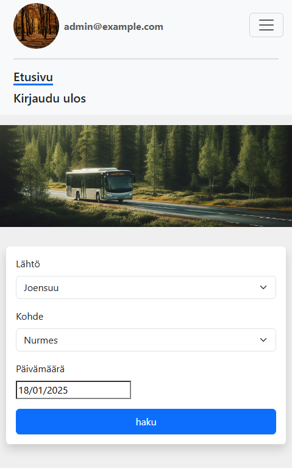
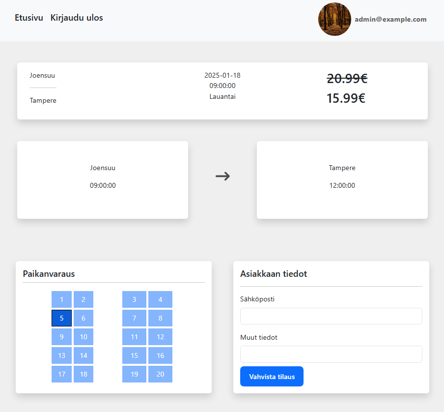
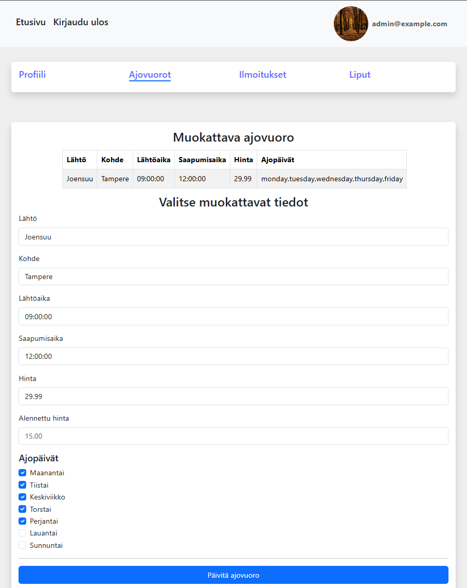

# Bus service app

<a href="https://example.com" target="_blank" style="display: inline-block; padding: 10px 20px; font-size: 32px; color: white; background-color: #007BFF; text-align: center; text-decoration: none; border-radius: 5px;">Click here to check out the live version!</a>

Table of contents

1. [Description](#1-description)
   1.1 [Images](#11-images)
2. [Prerequisites](#prerequisites) 2. [Steps](#steps)

# 1. Description

A full-stack web application designed for a potential bus travel company.

Key features:

- <b>Trip Search</b>: Users can search for trips based on departure city, destination city, and date.
- <b>Ticket Booking and Payments</b>: Secure payments are handled via Stripe. Tickets are stored in the database, and users receive a confirmation email. Logged-in users can view tickets in their profile. Seat reservation is also supported.
- <b>Admin Panel features</b>:
  - Send and delete messages which are visible in the front page for all users.
  - Add, delete and modify trip schedules.
  - View ticket purchase history.
- <b>Responsive design</b>: Responsivity designed for desktop and mobile devices.

## 1.1 Images

<div >
    <h1>Responsive design</h1>
    </img>
    <h1>Ticket purchase, Seat reservation</h1>
    </img>
    <h1>Admin panel, trip schedule modification</h1>
    </img>
  </div>

# 2. Technologies Used

## Frontend

| Technology   |                                                                                                                                 |
| ------------ | ------------------------------------------------------------------------------------------------------------------------------- |
| React (Vite) |          |
| Bootstrap 5  |  |
| TypeScript   |         |

## Backend

| Technology                                       |                                                                                                                                                                                       |
| ------------------------------------------------ | ------------------------------------------------------------------------------------------------------------------------------------------------------------------------------------- |
| .NET 8 (C#)                                      |                                                               |
| Entity Framework Core & <br/> Identity Framework |  |
| Stripe                                           |      |
| PostgreSQL                                       |                                                      |
| Minio                                            |                                                                                      |
| Swagger                                          |                                                                     |
| Mailkit                                          |                                                                                     |

## Testing

| Technology            | Logo                                                                                                                    |
| --------------------- | ----------------------------------------------------------------------------------------------------------------------- |
| Vitest                |         |
| React Testing Library |  |
| Cypress               |                                       |
| XUnit                 |                                 |

## DevOps & CI/CD

| Technology     |                                                                                                                           |
| -------------- | ------------------------------------------------------------------------------------------------------------------------- |
| Docker         |  |
| Github Actions |  |
| Ubuntu VPS     |  |
| NginX          |             |

## Logging

| Technology    |                                                                                                                                |
| ------------- | ------------------------------------------------------------------------------------------------------------------------------ |
| Serilog       |                                           |
| Elasticsearch |  |
| Kibana        |                |

# 3. Installation

## 3.1 Clone and cd to the repository:

```bash
git clone https://github.com/username/repository.git
```

```bash
 cd repository
```

## 3.2 Create necessary environment files:

The application requires certain environment variables to work properly.

Root Environment File:

```bash
touch .env
```

Example .env file

```env
MINIO_ROOT_USER=minio-admin
MINIO_ROOT_PASSWORD=minio-password
POSTGRES_PASSWORD=postgres-password
POSTGRES_USER=postgres
POSTGRES_DB=postgres
```

PostgreSQL and Minio will require additional setting up. Ensure that you have a database created that matches the POSTGRES_DB environment variable. Also create a Minio bucket called "minio". Docker setup includes Minio UI and pgAdmin to ease this.

Next, create environment file in the backend folder.
This step also requires creation of:

- Stripe account for payments and generating SECRET_KEY environment variable
- Email service for example gmail for generating EMAIL_PASSWORD_URI environment variable

- Production environment requires bonsai.io account by default (ELASTICSEARCH_URI). This can be skipped by doing some minor code changes to program.cs file to use different url or disable logging completely.

- Production environment originally uses cloud PostgreSQL database (DB_CONNECTION_STRING_PROD). This can be replaced with your own url or for example with minor code changes dev environment docker container can be used.

```bash
cd backend
```

```bash
touch .env
```

Example .env file

```env
SECRET_KEY=SECRET_KEY
BASE_DB_CONNECTION=Server=PostgreSQL 16;Host=localhost;Port=5432;Username=postgres;Password=postgres-password;Database=postgres
DB_CONNECTION_STRING_PROD=DB_CONNECTION_STRING_PROD
DB_CONNECTION_STRING_TEST=PostgreSQL 16;Host=localhost;Port=5432;Username=test-postgres;Password=test-postgres-password;Database=test-postgres
EMAIL_PASSWORD=EMAIL_PASSWORD
ELASTICSEARCH_URI=ELASTICSEARCH_URI
MINIO_ROOT_USER=minio-admin
MINIO_ROOT_PASSWORD=minio-password
DB_CONNECTION_STRING=Server=PostgreSQL 14;Host=postgres;Port=5432;Username=postgres;Password=password;Database=postgres
```

## 3.2 Run application with docker

development:

```bash
docker-compose up
```

testing:

```bash
docker-compose -f docker-compose.test.yml up
```

production:

```bash
docker-compose -f docker-compose.prod.yml up
```
